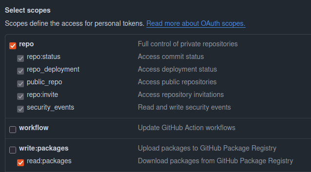
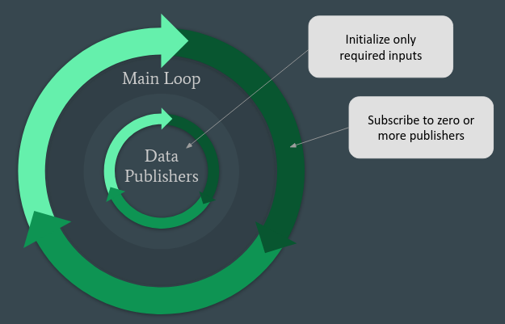

# OIST Smartphone Robot Android Framework

The main purpose of this repo is to host the abcvlib development. This is the library governing the OIST Smartphone Robot Android Framework. The framework is designed to provide a simple and easy to use interface for developing Android applications for the OIST Smartphone Robot.

This repo itself is an Android project, so opening the root of the repo in Android Studio will provide all build tools necessary to build the library and the example applications located in the apps directory.

Although abcvlib can be used as an external dependency (see [Using abcvlib as an external dependency](#using-abcvlib-as-an-external-dependency)), it is likely easier to get to know the API by looking at the example applications. The example applications are located in the apps directory and are designed to be simple examples of how to use core features of the library.

## Building abcvlib and the Example Applications

### Prerequisites
The following is a list of tools needed to build either abcvlib or any of the demo applications.

1. Java opensdk v17 or higher, with environmental variable JAVA_HOME set to the root of this sdk e.g. `/usr/lib/jvm/java-1.17.0-openjdk-amd64` (a requirement by modern Android gradle plugin versions)
2. BOTH git and GitHub command line interface (used to download packages and other larger assets from GitHub Packages)
3. Local environment variables GITHUB_USER and GITHUB_TOKEN (see [Managing your personal access tokens](https://docs.github.com/en/authentication/keeping-your-account-and-data-secure/managing-your-personal-access-tokens) for more information on how to create a token. The token must have full "repo" permissions.

4. Android SDK Tools (If you prefer the command line, you can use the Android Command Line Tools and avoid using Android Studio)
5. (Optional) Android Studio
6. (Optional) Docker can be used to provide all the above tools in a single ready-made image. See the [Docker README](docker/README.md) for more information.

### Building and Installing APKs
Start by cloning the repository

From here you have two choices. You can either use Android Studio or the command line to build the project.

#### 1.) Using Android Studio
1. Open the root of the repository in Android Studio
2. Build the project by clicking the hammer icon in the toolbar
3. Choose one of the build targets (backAndForth, basicSubscriber, basicAssembler) from the dropdown menu in the toolbar
4. Ensure you have a smartphone connected to your computer via adb, see [Pairing with a smartphone via wireless debugging](#pairing-with-a-smartphone-via-wireless-debugging) for more information
5. Click the green play button in the toolbar to install the APK on your device

#### 2.) Using the Command Line
There is an automated script to perform most of what is listed below, but it has only been tested on Ubuntu 22.04.
This script lies [here](https://github.com/topherbuckley/cmdline-tools-install/blob/main/install-cmdline-tools)
Manually, this does the following:

1. Download and unzip the Android Command Line Tools from the [Android Developer website](https://developer.android.com/studio#command-line-tools-only)
2. Unzip this to a location of your choice (e.g. ~/android_sdk)
3. Follow the silly manual directory restructuring steps [here](https://developer.android.com/tools/sdkmanager)
4. Install platform-tools, build-tools, and Android platform (`./sdkmanager "platform-tools" "platforms;android-30" "build-tools;33.0.1"`)
5. Accept all licenses (`y | ./sdkmanager --licenses`)
6. Set ANDROID_HOME env variable (`export ANDROID_HOME=~/android_sdk`)
7. Add platform-tools to your PATH (`export PATH=$PATH:$ANDROID_HOME/platform-tools`)

From here you can start building the project. There is also a terminal application to automate the below steps, and this is found at ./bi (build and install).

1. Navigate to the root of the repository
2. Run `./gradlew assembleDebug` to build the project (it will take a few minutes the first time as it downloads all the necessary dependencies)
3. You can build individual APKs by running `./gradlew <app_name>:assembleDebug` where `<app_name>` is one of the following: `backAndForth`, `basicSubscriber`, `basicAssembler`
4. You may need to uninstall the previous version of the APK before installing the new one. You can do this by running `adb uninstall jp.oist.abcvlib.backandforth` where `jp.oist.abcvlib.backandforth` is the package name of the APK you want to uninstall
5. Install the APK on your device by running `adb install -r <path_to_apk>` where `<path_to_apk>` is the path to the APK you just built e.g. `./apps/backAndForth/build/outputs/apk/debug/backAndForth-debug.apk`
6. Run the APK on your device via `adb shell am start -n jp.oist.abcvlib.backandforth/.MainActivity`

## Architecture

### State Variables
1. Camera
  a. Raw Images
  b. Hybrid Sensors (QR Code Boolean, coords of target, etc.)
2. Microphone
  a. Raw audio samples
3. Spatial sensors
  a. Accelerometer
  b. Gyroscope
  c. GPS
  d. Hybrid Sensors combining these
4. Wheels
  a. Raw encoder counts
  b. Hybrid Sensors (Relative position, speed, acceleration)
5. Power
  a. Internal battery voltage
  b. Charger voltage
  c. Wireless coil voltage

### Actions
1. Low Level Controller
  a. Direct control of motors via `outputs.setWheelOutput(float left, float right, boolean leftBrake, boolean rightBrake)`
2. Mid-level controllers
  b. e.g. See basicAssembler's ActionSpace
  c. Balance, Turn Left/Right, Move Forward/Backward 10mm

## Subscriber/Publisher Architecture
All state variables are published by the robot and can be subscribed to either directly within your MainActivity class (See apps/basicSubscriber) or via a TimeStepDataBuffer (See apps/basicAssembler) for examples of each. The following diagram shows the architecture of this system.


## Overview of API
Three demo applications exemplify the basic use of the API:
1. backAndForth
  a. Intentionally VERY bare-bones as a Hello World app for communicating between Android & Robot
  b. No feedback, just output via outputs.setWheelOutput
2. basicSubscriber
  a. Adding a minimal subscribe+read operation to all possible publishers.
  b. onCreate-->usbInitialize-->onSerialReady-->initializeOutputs-->onOutputsReady-->abcvlibMainLoop starts.
  c. Careful! There are several chronological dependencies in the initialization, so changing the order of any of these should be done with caution.
  d. Note: every onXXX method is called from a separate thread, so synchronization on shared variables can be messy
3. basicAssembler
  a. Assembles all subscribed data into TimeStepData objects (holder for all sampled state info within a single timestep)
  b. Takes the burden of synchronizing all the threads away. (See TimeStepDataBuffer)
    i. Synchronized get/set methods
    ii. Circular buffer for writing data, with read data separately
  c. Adds a high-level RL framework (StateSpace, ActionSpace, etc.)

## Pairing with a smartphone via wireless debugging
1. Ensure your smartphone is connected to the same network as your computer
2. Enable wireless debugging on your smartphone by following the instructions [here](https://developer.android.com/studio/command-line/wireless-debugging)
3. Run `adb pair <ip_address>:<port>` where `<ip_address>` is the IP address of your smartphone and `<port>` is the port number displayed on your smartphone
4. Run `adb connect <ip_address>:<port>` to connect to your smartphone

## Installing/Rolling back APK versions
APK builds and abcvlib .aar files are stored in Github Releases.
1. Download any versioned release in the [releases page](https://github.com/oist/smartphone-robot-android/releases)
2. Install the APK on your device by running `adb install -r <path_to_apk>`. You may also find the following adb flags helpful:

    - -r: replace existing application
    - -t: allow test packages
    - -d: allow version code downgrade (debuggable packages only)
    - -g: grant all runtime permissions
3. Run the APK on your device via `adb shell am start -n jp.oist.abcvlib.<AppName>/.MainActivity` where `<AppName>` is the name of the APK you just installed (e.g. `backandforth`)
4. Alternatively to step 3, you can open the app from the app drawer on your device


## Using abcvlib as an external dependency
Currently the package is hosted on GitHub Packages. To use it as a dependency in your project, add the following to your build.gradle file:

```gradle
repositories {
    maven {
        url = uri("https://maven.pkg.github.com/topherbuckley/smartphone-robot-android")
        credentials {
            username = project.findProperty("gpr.user") ?: System.getenv("GITHUB_USER")
            password = project.findProperty("gpr.key") ?: System.getenv("GITHUB_TOKEN")
        }
    }
}
dependencies {
    implementation 'jp.oist:abcvlib:v1.1.3'
}
```
See more information on how to use GitHub Packages [here](https://docs.github.com/en/packages/working-with-a-github-packages-registry/working-with-the-gradle-registry).
